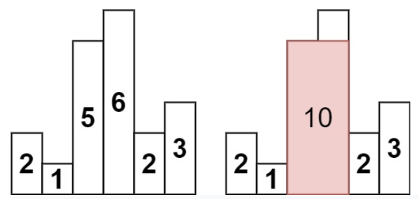
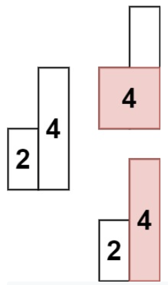

# Description:

Given an array of integers heights representing the histogram's bar height where the width of each bar is 1, return the area of the largest rectangle in the histogram.

## Example 1:

Input: heights = [2,1,5,6,2,3]

Output: 10

Explanation: The above is a histogram where width of each bar is 1.
The largest rectangle is shown in the red area, which has an area = 10 units.

## Example 2:

Input: heights = [2,4]

Output: 4

### Constraints:

1 <= heights.length <= 10^5

0 <= heights[i] <= 10^4
